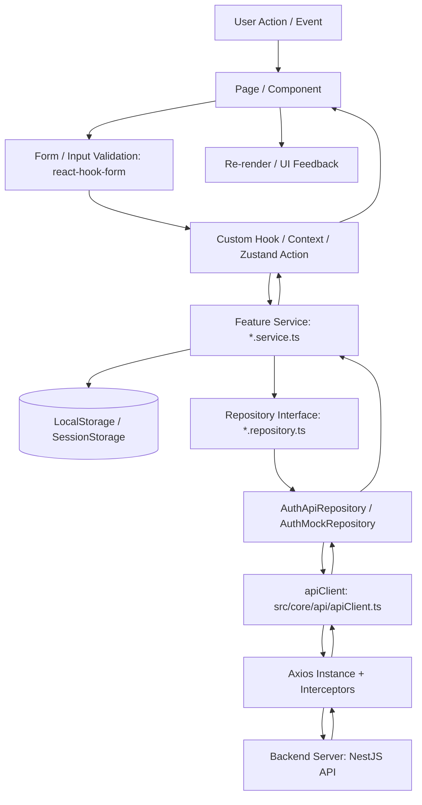

# Data Flow & Luồng dữ liệu (Web Frontend)

Tài liệu này mô tả chi tiết luồng di chuyển dữ liệu từ tương tác của người dùng trên giao diện (UI) đến Server và ngược lại.

---

## 1. Sơ đồ luồng dữ liệu tổng quan

---

## 2. Chi tiết từng chặng của luồng dữ liệu

### Chặng 1: UI Component (`pages/` hoặc `components/`)
- Tiếp nhận tương tác từ người dùng (Click, Submit, Scroll, Input change).
- Sử dụng `react-hook-form` để validate dữ liệu form trước khi gửi.
- Gọi trực tiếp hàm trong Service hoặc gọi action trong Store / Context.
- Hiển thị loading state (spinner / skeleton) và toast / thông báo lỗi khi có phản hồi.

### Chặng 2: Service Layer (`features/<feature>/services/*.service.ts`)
- Tiếp nhận DTO từ UI.
- Thực hiện logic phía Client: cập nhật LocalStorage (ví dụ: lưu thông tin `User`, cập nhật `Cart`), xử lý điều kiện phụ.
- Gọi method tương ứng trên `Repository`.
- Trả kết quả `ApiResponse<T>` về cho UI.

### Chặng 3: Repository Layer (`features/<feature>/repositories/*`)
- Nhận cấu hình từ `USE_MOCK` để quyết định gọi `ApiRepository` hay `MockRepository`.
- Định nghĩa đúng URL Endpoint, HTTP Method, Query parameters, Request Body và Return Type.
- Gọi `apiClient.get()`, `apiClient.post()`, `apiClient.put()`, `apiClient.delete()`.

### Chặng 4: Core Network (`core/api/apiClient.ts` & `axios.ts`)
- `axiosInstance` được cấu hình `withCredentials: true` (để gửi và nhận cookie `accessToken`/`refreshToken` tự động).
- `Request Interceptor`: Gắn thêm headers nếu cần.
- `Response Interceptor`: Bắt lỗi 401 Unauthorized để refresh token hoặc tự động redirect về trang `/login` nếu phiên đăng nhập hết hạn.

---

## 3. Quy tắc bắt buộc (Rules)

1. **KHÔNG BAO GIỜ** import `axios` trực tiếp trong Component/Page để gọi API.
2. **KHÔNG BAO GIỜ** bỏ qua tầng Service và Repository.
3. Luôn đảm bảo kiểu dữ liệu trả về từ Repository là `Promise<ApiResponse<T>>`.
4. Mọi lỗi mạng hoặc lỗi API trả về phải được bọc và hiển thị rõ ràng trên UI, không để crash ứng dụng (Uncaught Promise Error).
