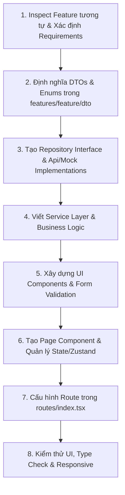

# Web Feature Development Workflow & Definition of Done

Bất kỳ AI Agent nào khi triển khai một tính năng mới hoặc chỉnh sửa tính năng hiện tại trên Web Frontend (`web/`), đều phải tuân thủ quy trình dưới đây.

---

## 1. Quy trình phát triển Feature 8 Bước

### Bước 1: Inspect & Chuẩn bị
- Tìm kiếm các feature tương tự đã có sẵn trong `src/features/` (ví dụ: `auth/`, `products/`, `cart/`).
- Tái sử dụng các UI components dùng chung từ `src/components/common/` (Button, Input, Modal, Badge).

### Bước 2: Định nghĩa DTO & Enums
- Tạo thư mục `src/features/<feature>/dto/` và `enums/`.
- Khai báo các TypeScript interfaces cho Request / Response.

### Bước 3: Tạo Repository Layer
- Khai báo Interface `<feature>.repository.ts`.
- Viết `<feature>Api.repository.ts` gọi `apiClient`.
- Viết `<feature>Mock.repository.ts` cung cấp dữ liệu giả lập.

### Bước 4: Viết Service Layer
- Tạo `<feature>.service.ts` khởi tạo repository dựa trên cờ `USE_MOCK`.
- Viết các method điều phối logic, lưu trữ LocalStorage, xử lý lỗi.

### Bước 5 & 6: Xây dựng UI & State
- Tạo Feature Components trong `src/features/<feature>/components/` hoặc `src/pages/<feature>/`.
- Áp dụng TailwindCSS v4 tokens từ `src/index.css`.
- Áp dụng `react-hook-form` cho form nhập liệu.
- Quản lý trạng thái bằng Zustand store (nếu là Admin/Phức tạp) hoặc React Context/useState.
- Đảm bảo có đủ 4 trạng thái: **Loading, Error, Empty, Success**.

### Bước 7: Cấu hình Routing
- Đăng ký Route trong `src/routes/index.tsx`.
- Gắn `AuthGuard` nếu route yêu cầu đăng nhập hoặc phân quyền role.

### Bước 8: Kiểm thử & Type Check
- Chạy `npm run build --prefix web` hoặc `npx tsc --noEmit` để đảm bảo 0 lỗi TypeScript.
- Kiểm tra giao diện trên cả màn hình Desktop và Mobile (Responsive).

---

## 2. Definition of Done (DoD) Checklist

Trước khi coi một feature là hoàn thành, Agent **PHẢI** kiểm tra các tiêu chí sau:

- [ ] Đã inspect code/feature tương tự trước khi tạo implementation mới.
- [ ] Dependency flow một chiều chuẩn: `UI Page -> Feature Component -> Service -> Repository -> apiClient -> Backend`.
- [ ] Không gọi `axios` trực tiếp trong React component.
- [ ] Không tạo duplicate Service / Repository / DTO nếu đã có thể tái sử dụng.
- [ ] Không hardcode mã màu hex tùy tiện, sử dụng đúng theme tokens trong `index.css`.
- [ ] Không sử dụng kiểu `any` tùy tiện trong TypeScript.
- [ ] Xử lý đầy đủ Loading State, Error State, Empty State.
- [ ] Bọc `AuthGuard` cho các private routes trong `routes/index.tsx`.
- [ ] Clean up các WebSocket listeners hoặc Timer trong `useEffect`.
- [ ] Đảm bảo không có warning hoặc lỗi TypeScript khi build (`npm run build --prefix web`).
